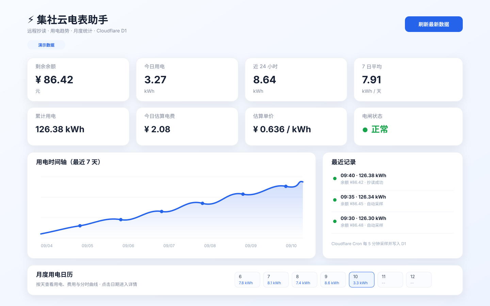
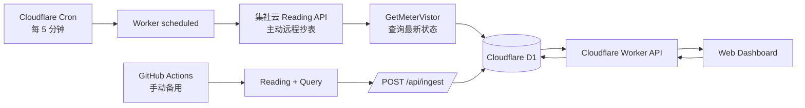

# ⚡ 集社云电表助手 / Jishe Meter Monitor

<p align="center">
  <strong>一个基于 Cloudflare Workers + D1 的轻量级集社云电表监控看板</strong><br/>
  自动抄表、历史统计、用电趋势、月度日历与单日明细，一页掌握宿舍 / 公寓电表状态。
</p>

<p align="center">
  <a href="https://jishe-meter-monitor.2001.life/"></a>
  <a href="https://github.com/xyooz/jishe-meter-monitor/stargazers"></a>
  <a href="https://github.com/xyooz/jishe-meter-monitor/commits/main"></a>
  
  
  
</p>

<p align="center">
  <a href="https://deploy.workers.cloudflare.com/?url=https://github.com/xyooz/jishe-meter-monitor"></a>
</p>

<p align="center">
  <a href="https://jishe-meter-monitor.2001.life/"><strong>🌐 在线看板</strong></a>
  · <a href="#-核心功能">核心功能</a>
  · <a href="#-系统架构">系统架构</a>
  · <a href="#-快速部署">快速部署</a>
  · <a href="#-api">API</a>
</p>

> [!NOTE]
> 在线看板启用了 Basic Auth。下图使用演示数据，仅用于展示界面与功能，不包含真实电表、余额或账户信息。

<p align="center">
  
</p>

## ✨ 为什么做这个项目

集社云可以查询电表数据，但如果想持续观察 **余额变化、每日用电、近 24 小时趋势、月度费用**，单次查询并不够直观。

Jishe Meter Monitor 将远程抄表、历史存储和可视化统计串成一条轻量链路：Cloudflare Cron 定时抄表，D1 保存历史记录，Web Dashboard 直接读取数据库并生成趋势、日历和单日明细。

整个生产链路不依赖常驻服务器，适合个人宿舍、公寓等小型电表监控场景。

## 🚀 核心功能

| 能力 | 说明 |
| --- | --- |
| ⚡ 自动抄表 | Cloudflare Workers Cron 每 5 分钟主动远程抄表 |
| 📊 实时看板 | 展示余额、累计用电、今日用电、近 24 小时和 7 日平均 |
| 📈 用电趋势 | ECharts 展示最近 7 天用电时间轴 |
| 📅 月度日历 | 按天统计月度用电与估算费用 |
| 🔍 单日明细 | 点击日期查看当天曲线、分时用电及采样记录 |
| 💰 电价估算 | 使用有效相邻样本中位数估算电价，规避充值造成的余额跳变 |
| 🗄️ D1 历史存储 | 抄读结果去重后持续写入 Cloudflare D1 |
| 📱 响应式界面 | 同时适配桌面端与手机端 |
| 🔐 访问保护 | Dashboard 使用 Basic Auth，入库接口使用独立 Bearer Token |
| 🧰 备用链路 | GitHub Actions 保留手动抄表与故障排查能力 |

> 历史统计从部署并开始记录后逐步积累。刚上线时没有足够历史数据，部分指标会显示 `0` 或“数据不足”。

## 🏗️ 系统架构



生产环境中，**采集链路与网页访问链路已经解耦**。

打开网页或点击“刷新最新数据”时只读取 D1，不会再次访问集社云，也不会等待外部接口响应。因此页面展示的是最近一次成功入库的采样结果，通常最多落后一个 Cron 周期。

### 两种刷新行为

- **立即抄读**：真实调用 Reading 接口完成一次远程抄表，然后查询最新状态并写入 D1。
- **刷新最新数据**：只重新读取 D1 中最近一次采样和统计结果，不触发真实抄表。

## 🔄 数据链路

### 自动采集

```text
Cloudflare Cron（每 5 分钟）
        ↓
Cloudflare Worker scheduled()
        ↓
集社云 Reading 接口
        ↓
GetMeterVistor
        ↓
去重并写入 Cloudflare D1
```

### Dashboard 查询

```text
打开网页 / 刷新最新数据
        ↓
Cloudflare Worker
        ↓
Cloudflare D1
        ↓
状态 / 历史 / 统计 / 日历
```

### GitHub Actions 备用链路

`.github/workflows/test.yml` 仅保留 `workflow_dispatch` 手动触发，用于 Cloudflare 异常时的备用抄读和排障验证。

```text
GitHub Actions（手动）
        ↓
Reading + GetMeterVistor
        ↓
POST /api/ingest
        ↓
Cloudflare D1
```

GitHub Actions 不再承担生产定时任务，避免同时维护两套调度器并产生重复抄读。

## 📁 项目结构

```text
public/index.html              Web 看板（ECharts）
src/dashboard.html            Worker 直出备用看板
src/index.js                   历史、日历、单日明细等 HTTP API
src/worker.js                  Cron 自动抄读、立即抄读与主 Worker 逻辑
src/entry.js                   D1-first 入口；状态/刷新/看板请求直接读取 D1
schema.sql                     D1 数据库表结构
wrangler.toml                  Cloudflare、Cron、D1、日志与静态资源配置
package.json                   Wrangler 开发 / 部署脚本
.dev.vars.example              本地开发 Secret 示例
jishe_meter.py                 GitHub Actions 备用抄表与查询脚本
.github/workflows/test.yml     手动备用抄读与 D1 入库
```

## ⚙️ 快速部署

### 方式 A：Deploy to Cloudflare（推荐）

点击下面的按钮：

<p>
  <a href="https://deploy.workers.cloudflare.com/?url=https://github.com/xyooz/jishe-meter-monitor"></a>
</p>

Cloudflare 会基于仓库中的 Wrangler 配置创建并绑定所需 D1 资源，并在部署过程中提示填写项目需要的 Secret。部署脚本会自动初始化 D1 表结构后发布 Worker。

需要准备：

```text
JISHE_PHONE
JISHE_CUSTOMER_ID
JISHE_ROOM_ID
JISHE_METER_ID
JISHE_SIGN
DASHBOARD_PASSWORD
INGEST_TOKEN
```

> [!IMPORTANT]
> 前 5 个参数必须来自同一套有效的集社云电表配置。`DASHBOARD_PASSWORD` 与 `INGEST_TOKEN` 建议使用随机长字符串。

### 方式 B：Wrangler 手动部署

#### 1. 安装依赖

```bash
git clone https://github.com/xyooz/jishe-meter-monitor.git
cd jishe-meter-monitor
npm install
npx wrangler login
```

#### 2. 准备 D1

首次自行部署时，请在自己的 Cloudflare 账户创建 D1，并将 `wrangler.toml` 中的 D1 配置指向自己的数据库。表结构可以通过以下命令初始化：

```bash
npm run db:init:remote
```

Cron 默认每 5 分钟执行一次：

```toml
[triggers]
crons = ["*/5 * * * *"]
```

#### 3. 配置 Secrets

> [!WARNING]
> 不要把手机号、房间 ID、电表 ID、签名、密码或鉴权 Token 提交到仓库。

可以复制 `.dev.vars.example` 作为本地开发参考；生产环境使用 Wrangler Secret：

```bash
npx wrangler secret put JISHE_PHONE
npx wrangler secret put JISHE_CUSTOMER_ID
npx wrangler secret put JISHE_ROOM_ID
npx wrangler secret put JISHE_METER_ID
npx wrangler secret put JISHE_SIGN
npx wrangler secret put DASHBOARD_PASSWORD
npx wrangler secret put INGEST_TOKEN
```

#### 4. 部署

```bash
npm run deploy
```

`npm run deploy` 会先执行 D1 schema 初始化，再部署 Worker；`schema.sql` 使用 `IF NOT EXISTS`，因此重复执行不会重复创建表或索引。

也可以使用 Cloudflare Git 集成，以 GitHub `main` 为生产分支，提交后自动执行 Wrangler 部署。

### 可选：配置 GitHub Actions 备用抄读

如果需要保留手动备用链路，再配置：

```text
JISHE_PHONE
JISHE_CUSTOMER_ID
JISHE_ROOM_ID
JISHE_METER_ID
JISHE_SIGN
DASHBOARD_BASE_URL
INGEST_TOKEN
```

其中 `DASHBOARD_BASE_URL` 为 Cloudflare Worker 公网根地址，例如：

```text
https://jishe-meter-monitor.xxx.workers.dev
```

GitHub 与 Cloudflare 中的 `INGEST_TOKEN` 必须完全一致。

## 🔌 API

```text
GET  /api/status        从 D1 返回最近一次成功采样状态
POST /api/read          从 D1 返回最近状态、历史和统计，不主动抄表
POST /api/manual-read   真实远程抄读一次，查询最新状态并写入 D1
POST /api/ingest        GitHub Actions 备用历史入库接口，Bearer Token 鉴权
GET  /api/history       查询 D1 历史记录
GET  /api/calendar      查询月度每日用电 / 费用
GET  /api/day           查询单日曲线、分时用电和采样明细
GET  /api/dashboard     从 D1 返回状态、历史数据与统计指标
```

`/api/manual-read` 由 Dashboard Basic Auth 保护；`/api/ingest` 不使用 Dashboard Basic Auth，而使用独立的 `INGEST_TOKEN`。

## 📐 统计口径

- “今日”按 `Asia/Shanghai` 日期边界计算。
- 近 24 小时按真实滚动时间窗口计算。
- 7 日平均按最近 7 天内实际存在采样数据的日期数计算，不会在数据不足 7 天时强制除以 7。
- 电价仅使用“电量增加且余额减少”的有效相邻样本计算，并取中位数，避免充值造成的余额上升污染估算。
- 月度费用同样忽略余额增加的充值事件。

## 🩺 常见排障

Workers Logs / Invocation Logs 中可以搜索：

```text
meter_cron      自动 Cron 抄读
meter_manual    网页“立即抄读”
dashboard_d1    D1 看板读取异常
```

自动或手动抄读失败时，优先查看 `meter_cron` 或 `meter_manual` 的 `stage`：

| stage | 含义 |
| --- | --- |
| `reading` | Reading 远程抄读阶段失败，常见于签名或电表参数不匹配 |
| `query` | 抄读后查询最新状态失败 |
| `d1` | 写入 D1 失败 |
| `complete` | 本轮执行成功 |

如果 Cloudflare 返回“签名错误”，而 GitHub Actions 使用同一电表可以正常抄读，应优先核对 Cloudflare 中的 `JISHE_PHONE`、`JISHE_CUSTOMER_ID`、`JISHE_ROOM_ID`、`JISHE_METER_ID`、`JISHE_SIGN` 是否与有效配置完全一致。

如果 Dashboard 可以打开但状态或统计读取失败，搜索 `dashboard_d1` 日志并优先检查 D1 绑定和数据库查询。

## 🧱 技术栈

- **Cloudflare Workers** — API、Dashboard 与 Cron 调度
- **Cloudflare D1** — 电表历史数据存储
- **ECharts 5** — 趋势和单日统计可视化
- **Wrangler 4** — 本地开发与部署
- **GitHub Actions** — 手动备用采集链路

## ⭐ Star

如果这个项目对你有帮助，欢迎点一个 **Star**。也欢迎提交 Issue 分享不同宿舍 / 公寓电表环境下的使用情况与改进建议。

---

<p align="center">
  Built for lightweight personal electricity monitoring ⚡
</p>
